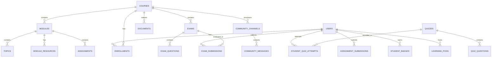

# 🧠 COGNIPATH — AI-Powered Personalized Learning Ecosystem
**Smart India Hackathon 2026 | Problem Statement: SIH262070/500 (Smart Education)**  
**Developed by Team AKAZA**  
**Live Platform:** [https://cogni-path-rose.vercel.app/](https://cogni-path-rose.vercel.app/)

---

## 📑 Table of Contents
1. [Executive Summary & Problem Statement](#1-executive-summary--problem-statement)
2. [High-Level Architecture & Tech Stack](#2-high-level-architecture--tech-stack)
3. [Core Architectural Pipelines](#3-core-architectural-pipelines)
   - 3.1. [Grounded RAG Pipeline (Anti-Hallucination Engine)](#31-grounded-rag-pipeline-anti-hallucination-engine)
   - 3.2. [SuperMemo SM-2 Spaced Repetition Engine](#32-supermemo-sm-2-spaced-repetition-engine)
   - 3.3. [At-Risk Heuristic Early Warning Engine](#33-at-risk-heuristic-early-warning-engine)
   - 3.4. [Native WebRTC Mesh & Learning Pods Protocol](#34-native-webrtc-mesh--learning-pods-protocol)
   - 3.5. [Bhashini Indian Language Multilingual Engine](#35-bhashini-indian-language-multilingual-engine)
   - 3.6. [Cryptographic SHA-256 Verifiable Credential Ledger](#36-cryptographic-sha-256-verifiable-credential-ledger)
4. [Exhaustive Feature & Sub-Feature Matrix](#4-exhaustive-feature--sub-feature-matrix)
   - 4.1. [Student Learning Portal & AI Tutor Drawer](#41-student-learning-portal--ai-tutor-drawer)
   - 4.2. [Hierarchical Course Delivery & Multimedia Workspace](#42-hierarchical-course-delivery--multimedia-workspace)
   - 4.3. [Interactive Course Catalog & Student Dashboard](#43-interactive-course-catalog--student-dashboard)
   - 4.4. [Dual-Engine Assessment Studio (Exam Studio)](#44-dual-engine-assessment-studio-exam-studio)
   - 4.5. [Spaced Repetition Flashcards & Adaptive Quizzes](#45-spaced-repetition-flashcards--adaptive-quizzes)
   - 4.6. [Assignment Engine & AI Rubric Auto-Evaluation](#46-assignment-engine--ai-rubric-auto-evaluation)
   - 4.7. [Adaptive Learning Roadmap & Knowledge Gap Radar](#47-adaptive-learning-roadmap--knowledge-gap-radar)
   - 4.8. [Live Collaborative Learning Pods (Live Kshetra)](#48-live-collaborative-learning-pods-live-kshetra)
   - 4.9. [Course Community Discussion Channels](#49-course-community-discussion-channels)
   - 4.10. [Educator Analytics & Curriculum Diagnostic Studio](#410-educator-analytics--curriculum-diagnostic-studio)
   - 4.11. [Authentication, RBAC & Multi-Role Academic Profiles](#411-authentication-rbac--multi-role-academic-profiles)
5. [Database Schema & Data Models](#5-database-schema--data-models)
6. [API Architecture & Endpoints](#6-api-architecture--endpoints)
7. [Security, Guardrails & Anti-Hallucination Framework](#7-security-guardrails--anti-hallucination-framework)
8. [Deployment & Verification](#8-deployment--verification)

---

## 1. Executive Summary & Problem Statement

### 1.1 The Challenge in Modern Higher Education
Traditional Learning Management Systems (LMS) such as Canvas, Moodle, and Blackboard operate as static document repositories. They suffer from critical deficiencies:
- **Zero Real-Time Context Grounding**: Commercial LLM chatbots hallucinate information that conflicts with the university syllabus, confusing students before exams.
- **Passive Content Consumption**: Students watch recorded lectures without retention verification, leading to rapid memory decay (Ebbinghaus forgetting curve).
- **Delayed Educator Interventions**: Educators discover struggling students only after mid-term exam failures, when recovery is difficult.
- **Language Barriers in Regional India**: English-dominated curriculum creates conceptual roadblocks for students from Tier-2/Tier-3 regions who think in Indic languages.
- **Fragmented Collaboration**: Students switch between disconnected tools (Zoom, WhatsApp, Quizlet, Google Classroom), losing learning context.

### 1.2 The CogniPath Solution
**COGNIPATH** is an end-to-end AI-powered personalized learning ecosystem built for engineering and higher education institutions. It unifies:
1. **Curriculum-Grounded AI Tutoring** with mathematical anti-hallucination prompts and clickable source citations down to the exact document and page number.
2. **SuperMemo SM-2 Spaced Repetition** flashcards that adapt review intervals based on difficulty and cognitive retention decay.
3. **Dual-Engine Assessments** (Module-end mastery checks and comprehensive final exams) with instant AI rubric evaluation and cryptographic SHA-256 verifiable credentials.
4. **Native Collaborative Learning Pods** featuring multi-peer WebRTC video conferencing, audio controls, live chat, and an in-pod `@Tutor` AI co-pilot.
5. **Educator Early-Warning Diagnostics** flagging at-risk students before exams with one-click remedial intervention dispatch.
6. **Bhashini Indian Language Translation** providing real-time NMT translation across 22 Scheduled Indian languages, ASR speech-to-text, and natural voice TTS.

---

## 2. High-Level Architecture & Tech Stack

```
+---------------------------------------------------------------------------------------+
|                                    COGNIPATH ECOSYSTEM                                 |
+---------------------------------------------------------------------------------------+
|  [PRESENTATION LAYER: React 18 + Vite SPA]                                            |
|    • Responsive Dark-Theme UI: Tailwind CSS, Custom Ambient Glow Canvases              |
|    • Component Icons & Visuals: Lucide React, Canvas Confetti, Mermaid.js, Cytoscape   |
|    • Mathematics & Formulas: KaTeX rendering for LaTeX math equations                |
|    • Real-Time Media: WebRTC Mesh, Canvas-based Protected PDF Viewer                  |
+---------------------------------------------------------------------------------------+
                                        │  HTTP REST / WebSocket (JSON, JWT Bearer)
                                        ▼
+---------------------------------------------------------------------------------------+
|  [APPLICATION LOGIC LAYER: FastAPI Backend (Python 3.11+)]                            |
|    • Authentication & RBAC: OAuth2 Password Bearer + JWT Token Cryptography           |
|    • Ingestion Service: PyPDF, python-docx, RecursiveCharacterTextSplitter            |
|    • Grounded RAG Service: Cosine Similarity Vector Search + Gemini 2.0 Flash          |
|    • SM-2 Spaced Repetition: Retention tracking, Easiness Factors, Interval math      |
|    • Pod Connection Manager: WebRTC SDP/ICE signaling + WebSocket broadcast sets     |
|    • At-Risk Heuristic Engine: Scoring thresholds, Inactivity timers, Intervention    |
|    • Curriculum Audit Engine: Syllabus alignment, Outdated concept detection           |
+---------------------------------------------------------------------------------------+
          │                                  │                                  │
          ▼                                  ▼                                  ▼
+-----------------------+          +--------------------+          +--------------------+
| Relational Storage    |          | Vector Database    |          | External AI APIs   |
| • PostgreSQL / SQLite |          | • ChromaDB v0.4+   |          | • Google Gemini    |
| • SQLAlchemy 2.0 Async|          | • Course-isolated  |          |   2.0 Flash LLM    |
| • Pydantic v2 Models  |          |   Collections      |          | • Bhashini ULCA    |
| • 28 Relational Tables|          | • Metadata tags    |          |   (NMT / ASR / TTS)|
+-----------------------+          +--------------------+          +--------------------+
```

### 2.1 Technology Stack Details
- **Frontend Framework**: React 18.3+, Vite 5.4, React Router DOM
- **UI & Styling**: Tailwind CSS 3.4, PostCSS, Lucide-React 0.4x, Canvas Confetti
- **Document Rendering**: HTML5 Canvas PDF rendering, Katex Math, Cytoscape.js, Mermaid.js
- **Backend API Engine**: FastAPI 0.110+, Uvicorn (ASGI), Pydantic v2, Python 3.11+
- **Database ORM**: SQLAlchemy 2.0 (AsyncSession), Alembic Migrations
- **Primary Databases**: SQLite (Local Dev / Portable Testing), PostgreSQL (Production Cloud)
- **Vector Database**: ChromaDB (Course-isolated vector spaces, cosine similarity)
- **Large Language Model**: Google Gemini 2.0 Flash (`google-genai` SDK) with automated circuit breakers
- **Government APIs**: Digital India Bhashini ULCA API (National Language Translation Mission)
- **Real-Time Video/Audio**: Native WebRTC PeerConnection mesh + WebSocket signaling

---

## 3. Core Architectural Pipelines

### 3.1. Grounded RAG Pipeline (Anti-Hallucination Engine)
```
Instructor Uploads PDF/DOCX/TXT
            │
            ▼
[PyPDF / python-docx Text Extraction]
            │
            ▼
[RecursiveCharacterTextSplitter] (Chunk size: 1000, Overlap: 150)
            │
            ▼
[Embedding Generation & Metadata Tagging] (Course ID, Doc ID, Page Number, Topic)
            │
            ▼
[ChromaDB Vector Indexing] (Stored in course-isolated collections)
            │
            │ Student asks question in AI Tutor
            ▼
[Query Semantic Vector Search] (Top-K matching with cosine similarity)
            │
            ▼
[Strict Grounding Prompt Construction] (Enforces "[Source: DocName, Page X]" format)
            │
            ▼
[Gemini 2.0 Flash LLM Generation] (Wrapped in asyncio thread pool)
            │
            ▼
Student receives verified answer with interactive, expandable citation badges!
```

### 3.2. SuperMemo SM-2 Spaced Repetition Engine
CogniPath implements the battle-tested **SuperMemo SM-2 algorithm** to mathematically combat cognitive memory decay:
$$\text{EF}' = \text{EF} + \left(0.1 - (5 - q) \times (0.08 + (5 - q) \times 0.02)\right)$$
Where:
- $\text{EF}$ is the **Easiness Factor** (initialized at $2.5$, with a hard floor at $1.3$).
- $q \in [0, 5]$ is the student's self-assessed response quality:
  - $q = 5$ (Easy): Perfect response without hesitation.
  - $q = 4$ (Good): Correct response after slight reflection.
  - $q = 3$ (Hard): Correct response recalled with significant difficulty.
  - $q < 3$ (Again): Incorrect response; interval resets to day 1.
- **Interval Days Calculation**:
  - If repetition $n = 1 \implies I_1 = 1 \text{ day}$
  - If repetition $n = 2 \implies I_2 = 6 \text{ days}$
  - If repetition $n > 2 \implies I_n = I_{n-1} \times \text{EF}'$

### 3.3. At-Risk Heuristic Early Warning Engine
The educator analytics dashboard constantly evaluates learners using a multi-factor diagnostic heuristic:
1. **Academic Performance Decay**: Average quiz or exam score $< 50\%$.
2. **Inactivity Flag**: Student has not logged in, completed topics, or attempted quizzes for $\ge 4$ consecutive days.
3. **Repetitive Doubt Loop**: Student asks 3+ doubts on foundational prerequisite concepts without an increase in subsequent quiz scores.
4. **Intervention Trigger**: When flagged, educators receive an immediate red alert badge with a one-click **"Intervene"** modal that dispatches personalized remedial study guides and practice quizzes directly to the student's inbox.

### 3.4. Native WebRTC Mesh & Learning Pods Protocol
- **No Third-Party SDK Lock-in**: Built natively using browser WebRTC `RTCPeerConnection` APIs without Agora or Twilio fees.
- **Signaling via WebSocket**: FastAPI WebSocket server manages offer, answer, and ICE candidate exchange between peers.
- **Adaptive RTT Signal Strength**: Regularly probes WebRTC `getStats()` candidate-pair metrics:
  - $\text{RTT} < 50\text{ms} \implies \text{Excellent (4 bars, Green)}$
  - $\text{RTT} < 100\text{ms} \implies \text{Good (3 bars, Green)}$
  - $\text{RTT} < 200\text{ms} \implies \text{Fair (2 bars, Yellow)}$
  - $\text{RTT} < 500\text{ms} \implies \text{Poor (1 bar, Orange)}$
  - $\text{RTT} \ge 500\text{ms} \implies \text{Critical (0 bars, Red)}$
- **In-Pod AI Tutor**: Students can invoke `@Tutor [question]` in the live pod text chat to get curriculum-grounded answers broadcasted to the study group in real time.

### 3.5. Bhashini Indian Language Multilingual Engine
CogniPath integrates with the Government of India's **Bhashini ULCA API** (National Language Translation Mission):
- **Neural Machine Translation (NMT)**: Real-time bidirectional translation between English and 22 Scheduled Indian languages (Hindi, Telugu, Tamil, Marathi, Bengali, Kannada, Gujarati, Malayalam, Odia, Punjabi, etc.).
- **Automatic Speech Recognition (ASR)**: Allows students to speak doubts in regional Indian languages directly through their browser microphone.
- **Text-to-Speech (TTS)**: Synthesizes high-fidelity voice readouts of curriculum answers in the student's preferred native accent.

### 3.6. Cryptographic SHA-256 Verifiable Credential Ledger
When students complete a course or pass a final exam with $\ge 70\%$ score:
- A unique SHA-256 cryptographic digital badge is generated:
  $$\text{Hash} = \text{SHA-256}(\text{StudentID} \parallel \text{CourseID} \parallel \text{Score} \parallel \text{Timestamp})$$
- Stored in the `StudentBadge` ledger table.
- Accessible via a public, tamper-proof verification URL: `/badges/verify/{hash}`, allowing recruiters, institutions, and employers to independently verify student mastery without database credentials.

---

## 4. Exhaustive Feature & Sub-Feature Matrix

### 4.1. Student Learning Portal & AI Tutor Drawer
*Accessible via Sidebar: "AI Tutor"*

| Sub-Feature | Description | Technical Implementation |
| :--- | :--- | :--- |
| **Grounded AI Tutor Chat** | Conversational chat interface grounded strictly in uploaded course lecture notes and textbooks. | Uses FastAPI `/api/v1/tutor/chat`, querying ChromaDB vector collections before querying Gemini 2.0 Flash. |
| **Interactive Source Citations** | Clickable pills displayed below AI answers showing document name, page number, and similarity score. | Extracted from ChromaDB chunk metadata; clicking expands the exact source excerpt. |
| **Anti-Hallucination Guardrail** | System prompt instructs the model to state "I cannot find this in your course materials" if the answer is not present in syllabus. | System prompt with zero-shot rejection protocol in `rag_service.py`. |
| **Socratic Dialog Mode** | Guided inquiry mode where the AI guides students through step-by-step questions instead of providing direct answers. | `socratic_service.py` with multi-turn pedagogical prompts and concept scaffolding. |
| **Concept Mindmap Generator** | Visual concept relationship graph generated dynamically from the current doubt. | Rendered via Cytoscape.js and Mermaid diagrams in `SocraticMindmap.jsx`. |
| **Voice Input (ASR)** | Speak doubts into the browser microphone with automatic transcription. | Web Audio API + Bhashini ULCA ASR pipeline. |
| **Voice Readout (TTS)** | Listen to AI tutor responses spoken aloud in natural speech. | Bhashini ULCA Text-to-Speech synthesizer. |
| **Multilingual Switcher** | Toggle conversation and responses into regional Indic languages on the fly. | Bhashini NMT pipeline across 22 Scheduled Indian languages. |
| **Course Context Selector** | Switch between enrolled courses to scope the AI tutor's vector search context. | Dropdown updating active `course_id` sent to tutor API. |
| **Conversation History Persistence**| Retains recent chat messages and citations during the session. | Managed via React state and local storage session sync. |

---

### 4.2. Hierarchical Course Delivery & Multimedia Workspace
*Accessible via Sidebar: "Course Player"*

| Sub-Feature | Description | Technical Implementation |
| :--- | :--- | :--- |
| **Course Hierarchy Engine** | Structured four-tier curriculum hierarchy: Course $\to$ Modules $\to$ Topics $\to$ Resources. | Fetched via `GET /courses/{id}/hierarchy` in `CourseWorkspace.jsx`. |
| **Collapsible Curriculum Sidebar**| Interactive accordion showing module progress, topic durations, and resource counts. | `CurriculumTreeSidebar.jsx` with active topic highlighting. |
| **Primary Video Lecture Player** | Stream lecture videos with playback rate control and progress recording. | Embedded HTML5 video player with stateful playback timers. |
| **Ephemeral Supplementary Video**| AI-curated short secondary video player for targeted prerequisite reinforcement without leaving the lesson. | `SupplementaryVideoPlayer.jsx` client-scoped overlay. |
| **Protected View-Only PDF Viewer**| Canvas-rendered PDF reader with copy, paste, and right-click download restrictions to protect faculty IP. | HTML5 Canvas rendering of PDF pages with zoom controls and page jump navigation. |
| **Topic Completion Checkbox** | Interactive completion toggle that updates user progress and triggers confetti animations. | Calls `/courses/topics/{id}/complete` and updates milestone percentages. |
| **Progression Gating** | Prevents advancing to advanced topics until module mastery exams are attempted. | Local and backend completion check tracking `isModuleExamPassed`. |
| **Course & Topic Rating System** | 5-star rating modal with written review submissions for both courses and individual topics. | `CourseRatingModal.jsx` posting to `/courses/{id}/rate` and `/topics/{id}/rate`. |
| **Cogni Tutor Slide-Out Drawer** | Slide-out drawer allowing students to ask doubts without losing their place in the video or PDF notes. | `CogniTutorDrawer.jsx` overlaying the workspace. |

---

### 4.3. Interactive Course Catalog & Student Dashboard
*Accessible via Sidebar: "Dashboard" or "Browse Catalog"*

| Sub-Feature | Description | Technical Implementation |
| :--- | :--- | :--- |
| **"Continue Learning" Track Grid** | Visual card grid showing all enrolled courses with colorful progress bars and "Resume" actions. | `EnrolledCoursesGrid.jsx` mapping `JourneyTrackCard.jsx`. |
| **Milestone Sequence Visualizer** | Horizontal 6-stage milestone sequence showing student journey stages (e.g., Arrays $\to$ Trees $\to$ Graphs). | `PRESET_MILESTONES` in `JourneyTrackCard.jsx` with active fill percentages. |
| **"My Created Courses" (Educator)**| Dedicated section for educators displaying only the courses they authored, with management and delete controls. | Strict filtering by `String(c.educator_id) === String(user.id)`. |
| **Smart Catalog Modal Explorer** | Fullscreen course search dialog with category filters (Computer Science, DBMS, Web Dev, AI) and sorting. | `CourseCatalogModal.jsx` calling `coursesAPI.explore()`. |
| **Smart Enrolled Course Exclusion**| Automatically hides already-enrolled courses from the catalog so students only see new offerings. | Client and server set intersection filtering `!enrolledIds.has(c.id)`. |
| **Instant Course Enrollment** | One-click enrollment adding courses to the student's dashboard immediately. | Calls `POST /courses/{id}/enroll` and syncs local storage. |
| **Safe Course Drop / Unenroll** | Students can remove courses from their account without affecting other enrolled learners or deleting the course. | Calls `POST /courses/{id}/unenroll`, preserving curriculum records. |
| **Permanent Creator Delete** | Creators and Admins can permanently delete courses they authored, erasing modules and vector indices. | Strict RBAC check in `CourseDeleteModal.jsx` calling `DELETE /courses/{id}`. |
| **One-Click Demo Personas** | Instant login buttons for Aarav (Student), Priya (At-Risk), Rohit (Inactive), and Prof. Rajesh (Educator). | Pre-configured authentication handlers in `Login.jsx`. |

---

### 4.4. Dual-Engine Assessment Studio (Exam Studio)
*Accessible via Sidebar: "Assessment Studio"*

| Sub-Feature | Description | Technical Implementation |
| :--- | :--- | :--- |
| **Module End Mastery Quizzes** | 10-15 minute quizzes testing specific module learning objectives. | `Exam` model with `exam_type: MODULE_QUIZ`. |
| **Comprehensive Final Exams** | 45-90 minute final exams testing entire course curriculum with passing certificate requirements. | `Exam` model with `exam_type: FINAL_EXAM`. |
| **AI RAG Question Generator** | Auto-generates 4-5 multiple choice questions with 4 options, explanations, and citations grounded in module notes. | Calls `coursesAPI.generateExamRAG()` leveraging Gemini 2.0 Flash. |
| **Manual Assessment Studio** | Educators can author custom MCQ questions, set correct options, and supply pedagogical explanations. | Interactive question builder modal in `ExamStudio.jsx`. |
| **Question Reordering & Editing** | Drag/move questions up and down to structure the exam layout. | Client-side reordering updating `order_index`. |
| **Target Course Selector** | Dropdown inside the creation modal strictly scoping assessments to courses authored by the educator. | Validates educator ownership before posting to `/exams`. |
| **Exam Taking Countdown Timer** | Live countdown clock with auto-submission when time expires. | JavaScript interval timer in `ExamStudio.jsx` calling `handleAutoSubmit()`. |
| **Instant AI Grading & Evaluation**| Instantaneous grading computing percentage score, pass/fail status, and detailed feedback per question. | Backend endpoint `/exams/{id}/submit` evaluating question answers. |
| **Passing Confetti & Digital Badges**| Confetti celebration upon passing threshold ($\ge 60\%-70\%$) with automatic digital credential generation. | `canvas-confetti` + `StudentBadge` issuance with SHA-256 verification hash. |
| **Public Credential Verification**| Public verification link verifying badge authenticity, student name, and issue date. | `GET /badges/verify/{hash}` in `courses.py`. |

---

### 4.5. Spaced Repetition Flashcards & Adaptive Quizzes
*Accessible via Sidebar: "Flashcards" & "Spaced Quizzes"*

| Sub-Feature | Description | Technical Implementation |
| :--- | :--- | :--- |
| **3D Interactive Card Flip** | CSS 3D transform flashcards that flip between Question (Front) and Explanation/Formula (Back). | `SpacedQuizView.jsx` with perspective animation. |
| **Dynamic AI Flashcard Generator** | Converts course notes into interactive flashcards dynamically for any enrolled course. | Queries `quizzesAPI.generate()` and maps MCQs into flashcard front/back pairs. |
| **Fisher-Yates Deck Shuffle** | Shuffles flashcard order each time a deck or course is loaded to prevent positional memorization. | In-place Fisher-Yates array shuffling algorithm in React. |
| **Self-Assessment Rating Buttons** | Four quality buttons: "Again" ($q=1$), "Hard" ($q=3$), "Good" ($q=4$), "Easy" ($q=5$). | Inputs to SuperMemo SM-2 interval calculator. |
| **SM-2 Interval Scheduling** | Calculates the exact next review date (e.g., 1 day, 6 days, 15 days) based on the user's score history. | Persisted in `StudentConceptRetention` table. |
| **Course-Filtered Flashcard Decks**| Scopes flashcard decks strictly to courses the student is actively enrolled in. | Dropdown filter synced with `enrolledCourses`. |
| **Regenerate Deck Action** | One-click button to clear current cards and generate fresh questions from course topics. | Standalone `fetchCards` handler resetting card index and flip state. |

---

### 4.6. Assignment Engine & AI Rubric Auto-Evaluation
*Accessible via Sidebar: "Assignments"*

| Sub-Feature | Description | Technical Implementation |
| :--- | :--- | :--- |
| **Module Assignment Manager** | View all assignments tied to the selected course module with due dates and max point values. | `AssignmentView.jsx` calling `assignmentsAPI.listByModule()`. |
| **Educator Rubric Designer** | Educators define multi-dimensional scoring rubrics (e.g., Accuracy: 40%, Clarity: 30%, Code Quality: 30%). | Stored as JSON in `Assignment.rubric_json`. |
| **Student Submission Portal** | Text submission area and external file/GitHub repository URL inputs. | `AssignmentSubmission` model with duplicate submission guards. |
| **AI Auto-Evaluation Engine** | Analyzes student submissions against the educator's rubric using Gemini 2.0 Flash. | `assignment_service.py` generating criterion scores and qualitative suggestions. |
| **Educator Grade Override** | Educators can review AI grading, modify scores, and add manual instructor comments. | Editable grade fields in Educator view of `AssignmentView.jsx`. |

---

### 4.7. Adaptive Learning Roadmap & Knowledge Gap Radar
*Accessible via Sidebar: "Learning Roadmap"*

| Sub-Feature | Description | Technical Implementation |
| :--- | :--- | :--- |
| **Personalized Skill Graph** | Interactive node-link graph showing mastered skills, in-progress topics, and locked future modules. | Rendered via Cytoscape / SVG graph in `LearningRoadmapView.jsx`. |
| **Knowledge Gap Radar Chart** | Multi-axis radar diagram displaying competency levels across core course domains (e.g., Algorithms, Memory, I/O). | Polar radar visualization highlighting score deficits below $60\%$. |
| **Remedial Topic Recommendations**| Dynamically suggests prerequisite topics when foundational deficiencies are detected. | Calculated by `roadmap_service.py` based on recent quiz errors. |
| **Milestone Prerequisite Mapping**| Visually marks dependencies required before unlocking advanced topics. | Directed Acyclic Graph (DAG) validation in `roadmap.py`. |

---

### 4.8. Live Collaborative Learning Pods (Live Kshetra)
*Accessible via Sidebar: "Learning Pods"*

| Sub-Feature | Description | Technical Implementation |
| :--- | :--- | :--- |
| **Native Multi-Peer WebRTC Video**| High-performance video conferencing supporting up to 8 peers simultaneously in an interactive grid. | Mesh `RTCPeerConnection` configuration with Google STUN fallbacks in `LiveKshetraNative.jsx`. |
| **Independent Mic & Camera Toggles**| One-click controls to toggle local webcam video and microphone streams. | `MediaStream.getAudioTracks()` and `getVideoTracks()` controls. |
| **Unmute Consent Security Modal**| Prevents forced unmuting by requiring explicit student consent when host requests unmute. | `UnmuteConsentModal.jsx` protocol exchange. |
| **RTT Signal Strength Bars** | 4-bar signal quality indicator per participant based on live WebRTC Round-Trip Time telemetry. | Inline `SignalBars` component updated every 3 seconds via `pc.getStats()`. |
| **In-Pod Live Chat Stream** | Real-time text chat synchronized across all connected room peers. | WebSocket broadcast channel in `pod_service.py`. |
| **In-Pod `@Tutor` AI Co-Pilot** | Students can type `@Tutor [doubt]` in the room chat to receive curriculum-grounded answers live in the pod. | Handled via `rag_service.query_course_context()` in `pods.py`. |
| **Host Moderation Controls** | Room host can kick disruptive peers, end the session for everyone, or mute participants. | Gated by `pod.host_id == current_user.id`. |
| **Auto-Reconnect Socket Handler** | Gracefully handles network blips by replacing stale sockets without treating returning peers as new connections. | Socket identity verification in `PodConnectionManager`. |

---

### 4.9. Course Community Discussion Channels
*Accessible via Sidebar: "Community"*

| Sub-Feature | Description | Technical Implementation |
| :--- | :--- | :--- |
| **Native Channel Architecture** | Every course automatically provisions three dedicated channels: `#general`, `#doubts-and-qa`, `#exam-prep`. | Provisioned upon course creation in `courses.py`. |
| **"My Communities" vs "Discover"**| Left navigation tab separating joined course communities from available platform communities. | Tabbed state in `CommunityFeed.jsx`. |
| **Instant Community Search** | Search communities by course code (e.g., "101"), course title, or educator name. | Real-time regex and substring matching in `CommunityFeed.jsx`. |
| **Message Thread Feed** | Real-time chat feed displaying author avatars, roles, timestamps, and message contents. | Fetched from backend via `GET /communities/channels/{id}/messages`. |
| **Peer Upvoting System** | Students can upvote insightful answers to highlight high-quality peer responses. | `POST /communities/messages/{id}/upvote` incrementing `upvotes` counter. |
| **Verified Solution Badge** | Educators can mark student answers as the "Verified Official Solution", pinning them to the top. | `is_solution: Boolean` flag restricted to course educators. |

---

### 4.10. Educator Analytics & Curriculum Diagnostic Studio
*Accessible via Sidebar: "Analytics"*

| Sub-Feature | Description | Technical Implementation |
| :--- | :--- | :--- |
| **Class Performance Metrics** | Aggregated overview of total enrolled students, average quiz scores, and active study hours. | `EducatorDashboard.jsx` calling `analyticsAPI.getOverview()`. |
| **Heuristic At-Risk Student Alert**| Automated alerts identifying struggling students based on score decay, inactivity, and doubt frequency. | `analytics_service.py` flagging students with score $< 50\%$ or inactivity $\ge 4$ days. |
| **One-Click Targeted Intervention**| Educators can dispatch personalized remedial study guides directly to flagged students. | `POST /analytics/intervene` triggering direct student notifications. |
| **Knowledge Document Ingestion** | Drag-and-drop file uploader supporting `.pdf`, `.docx`, and `.txt` course materials. | `documentsAPI.upload()` invoking `ingestion_service.py` text chunking. |
| **Curriculum Health Audit Studio** | AI diagnostic engine auditing course syllabi for outdated concepts, conceptual gaps, and learning balance. | `curriculum_audit_service.py` generating comprehensive health audit scores. |
| **Permanent Course Management** | Educators can edit course metadata or permanently erase courses they authored. | `onDeleteCoursePermanently` gated strictly to course creators. |

---

### 4.11. Authentication, RBAC & Multi-Role Academic Profiles
*Accessible via Navbar Profile & Login Views*

| Sub-Feature | Description | Technical Implementation |
| :--- | :--- | :--- |
| **JWT Token Authentication** | Secure bearer token issuance with encrypted password verification using `passlib` bcrypt. | `backend/app/core/security.py` issuing standard HS256 tokens. |
| **Role-Based Access Control (RBAC)**| Granular role separation: `STUDENT`, `EDUCATOR`, and `ADMIN`. | FastAPI dependency `require_roles()` securing sensitive mutation routes. |
| **IDOR Course Ownership Checks** | Educators can only edit, add exams to, or delete courses they authored. | `_check_course_ownership()` helper in backend APIs. |
| **Academic Profile Modal** | Multi-field profile editor for setting institution, department, academic bio, and avatar. | `AcademicProfileModal.jsx` calling `authAPI.updateProfile()`. |
| **Bhashini Language Switcher** | Global navbar modal allowing users to switch interface into 22 Indian regional languages. | `App.jsx` language selector storing `targetLang` in local storage. |
| **Session Auto-Restoration** | Automatically restores session tokens and enrolled courses on page refresh. | React `useEffect` reading persisted `cognipath_user` and `cognipath_token`. |

---

## 5. Database Schema & Data Models

CogniPath uses an asynchronous SQLAlchemy 2.0 ORM architecture across 28 relational tables:



### Table Schema Summary

1. **`users`**: User identity, hashed passwords, roles (`STUDENT`, `EDUCATOR`, `ADMIN`), preferred language, and academic bio.
2. **`courses`**: Course title, code, description, category, difficulty, thumbnail URL, and `educator_id`.
3. **`enrollments`**: Junction table tracking student enrollment dates, progress percentages, and last access timestamps.
4. **`modules`**: Course syllabus modules with sequential `order_index`, exam attachment flags, and `module_exam_id`.
5. **`topics`**: Granular lecture topics with video stream URLs, duration seconds, and student completion flags.
6. **`module_resources`**: Uploaded lecture slide decks, syllabus outlines, and PDF documents attached to modules.
7. **`documents`**: Course materials parsed into vector embeddings with file sizes and chunk counts.
8. **`exams`**: Dual-engine assessments (`MODULE_QUIZ` or `FINAL_EXAM`) with time limits, passing scores, and creator IDs.
9. **`exam_questions`**: Assessment questions with JSON options, correct answers, explanations, and source references.
10. **`exam_submissions`**: Student exam attempts with score percentages, pass/fail status, and question feedback.
11. **`student_badges`**: Verifiable academic credentials issued with cryptographic SHA-256 validation hashes.
12. **`quizzes`** & **`quiz_questions`**: Practice quiz items generated by RAG with source chunk references.
13. **`student_quiz_attempts`**: Historical records of student quiz attempts and score breakdowns.
14. **`student_concept_retention`**: SuperMemo SM-2 tracking table storing Easiness Factor (EF), repetition count, and next review date.
15. **`learning_pods`**: Real-time study groups with unique room codes, active statuses, and maximum peer counts.
16. **`pod_messages`**: Live chat logs in learning pods including `@Tutor` AI responses.
17. **`community_channels`**: Course discussion channels (`general`, `doubts-and-qa`, `exam-prep`).
18. **`community_messages`**: Discussion posts with upvote counts and educator-pinned solution indicators.
19. **`assignments`** & **`assignment_submissions`**: Module assignments with educator rubrics and AI auto-grading results.
20. **`course_ratings`** & **`topic_ratings`**: 5-star ratings and student reviews for curriculum quality monitoring.

---

## 6. API Architecture & Endpoints

All endpoints are versioned under `/api/v1` and documented automatically via OpenAPI / Swagger at `/docs`:

### Authentication (`/api/v1/auth`)
- `POST /register`: Create new Student or Educator account with hashed credentials.
- `POST /login`: Authenticate credentials and return JWT bearer token.
- `GET /me`: Fetch authenticated user profile and permissions.
- `PUT /profile`: Update academic affiliation, bio, avatar, and preferred language.

### Courses & Syllabus (`/api/v1/courses`)
- `GET /`: List all available platform courses.
- `GET /explore`: Full-text search and filter courses with enrollment status and ratings.
- `GET /{id}`: Fetch detailed course syllabus and instructor metadata.
- `GET /{id}/hierarchy`: Retrieve nested Course $\to$ Module $\to$ Topic $\to$ Resource tree.
- `POST /`: Create a new course (strictly gated to Educators and Admins).
- `DELETE /{id}`: Permanently erase a course and its vector collections (Creator/Admin only).
- `POST /{id}/enroll`: Enroll the authenticated student in a course.
- `POST /{id}/unenroll`: Drop a course for the current student without affecting others.
- `POST /modules/{id}/generate-exam-rag`: Auto-generate 5 MCQs from module notes using Gemini RAG.
- `GET /badges/verify/{hash}`: Public verification endpoint for student credentials.

### Assessments & Exams (`/api/v1/exams`)
- `GET /course/{course_id}`: List all published exams for a specific course.
- `GET /{id}`: Fetch exam questions and instructions.
- `POST /`: Create a new Module Quiz or Final Exam (Creator/Admin only).
- `PUT /{id}`: Update questions, time limit, or passing score for an exam.
- `POST /{id}/submit`: Submit answers for instant grading, feedback, and badge issuance.
- `POST /suggest-ai`: Generate AI question recommendations grounded in course topics.

### AI Tutor & Grounded Doubt Solving (`/api/v1/tutor`)
- `POST /chat`: Submit a doubt and receive an anti-hallucination grounded response with citations.
- `POST /socratic`: Engage in a multi-turn Socratic inquiry session with guided concept scaffolding.
- `POST /mindmap`: Generate a concept relationship graph for the current topic.

### Spaced Repetition Quizzes (`/api/v1/quizzes`)
- `POST /generate`: Generate a practice quiz from course notes with SM-2 scheduling.
- `POST /attempt`: Submit quiz answers and update concept retention intervals.
- `GET /retention/due`: Fetch all flashcard concepts due for review today.

### Learning Pods (`/api/v1/pods`)
- `GET /`: List active learning pods for a course.
- `POST /`: Create a new video/audio learning pod with room code.
- `GET /{id}`: Fetch pod details and active peer list.
- `POST /{id}/end`: End the pod session for all participants (Host/Admin only).
- `WS /ws/{pod_id}`: WebSocket signaling endpoint for WebRTC peer connection and in-pod chat.

### Communities (`/api/v1/communities`)
- `GET /courses/{id}/channels`: Fetch channels for a course.
- `GET /channels/{id}/messages`: Fetch chronological message thread.
- `POST /channels/{id}/messages`: Post a question or discussion topic.
- `POST /messages/{id}/upvote`: Upvote a peer answer.
- `POST /messages/{id}/solution`: Mark an answer as verified official solution.

### Educator Analytics (`/api/v1/analytics`)
- `GET /overview/{course_id}`: High-level class metrics, average scores, and completion rates.
- `GET /at-risk/{course_id}`: List struggling students flagged by the heuristic engine.
- `POST /intervene`: Dispatch customized remedial materials to an at-risk learner.

---

## 7. Security, Guardrails & Anti-Hallucination Framework

### 7.1 Mathematical Grounding & Prompt Engineering
To prevent hallucination in academic contexts, the tutor service applies strict prompt boundaries:
1. **Source Citation Requirement**: Every response must cite exact document names and page references: `[Source: CS101_Lecture_04.pdf, Page 2]`.
2. **Zero-Knowledge Rejection**: If the topic is not covered in the retrieved ChromaDB chunks, the model refuses to guess: *"I cannot find this concept in your course syllabus. Please consult your instructor or check related modules."*
3. **Circuit Breaker Resilience**: Automated fallback across `gemini-2.0-flash` with circuit breaker recovery to prevent denial of service during API rate limits.

### 7.2 Insecure Direct Object Reference (IDOR) Protections
All course and assessment mutation endpoints enforce ownership checks:
```python
if user.role != "ADMIN" and course.educator_id != user.id:
    raise HTTPException(status_code=403, detail="You do not own this course.")
```
Educators cannot modify, delete, or create exams for courses authored by other faculty members.

### 7.3 IP Protection for Academic Materials
- Lecture slide decks and notes are rendered via protected HTML5 Canvas elements.
- Direct file download buttons are disabled for students on view-only resources.
- Browser print, text selection, and context-menu copy events are restricted on sensitive course documents.

---

## 8. Deployment & Verification

### 8.1 Production Deployment
- **Frontend**: Deployed on Vercel Edge Network with automatic Vite production bundling (`npm run build`).
- **Backend API**: Deployed with Uvicorn ASGI server and async connection pooling.
- **Continuous Integration**: Automated GitHub Actions workflows verifying:
  - Code formatting and Ruff linting.
  - Python imports and environment dependencies.
  - Pytest unit and integration test suite (`tests/`).

### 8.2 Test Verification
The backend includes an automated pytest suite covering:
- Document upload size and extension validation (413 and 400 rejection).
- Token extraction and RBAC authorization verification.
- WebRTC peer connection signaling and reconnect handling.
- Spaced repetition interval calculations and SM-2 formula correctness.
- In-pod AI tutor queries and WebSocket communication.

---

**COGNIPATH** — *Empowering every learner with personalized, grounded, and accessible AI education.*
